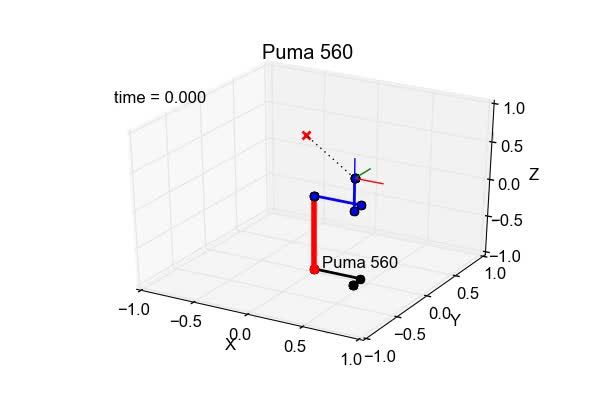

## robotics-toolbox-python-update1 ##
Robotics Toolbox for Python - Update 1

This is a 1st update on the
'[**old first attempt**](https://github.com/petercorke/robotics-toolbox-python)'
at creating an open Python version of Peter Corke's
[**Robotics Toolbox for MATLAB**](http://petercorke.com/wordpress/toolboxes/robotics-toolbox)**&reg; (RTB) &copy; 1993-2018**.
Although the **Robotics Toolbox for Python &copy; 1993-2016** [repository](https://github.com/petercorke/robotics-toolbox-python) has languished over the past
decade, there may still be some interest in its revival; even in its dated and
rudimentary form. At this point, there is no intent to morph RTB for Python into
another feature rich robot simulation tool extensively dependent on 3rd party packages
and libraries. However, it should be noted that the present RTB for Python architecture
relies exclusively on the 'pylab' convenience module, a practice not recommended by
[Matplotlib](https://matplotlib.org/faq/usage_faq.html#matplotlib-pyplot-and-pylab-how-are-they-related)
developers.

#### Getting Started ####

Download, unpack and run demos and tests as described in the README files, or
optionally just build and install with the provided setup.py script (e.g., python
setup.py install). Best use experience with RTB for Python is in IPython's
interactive Pylab shell mode. For example, to display an animation of the Puma
560 (standard) robot transition from a nominal pose to a ready pose, invoke IPython
in the demo or test directory and enter the six commands as shown below.

$ ipython --matplotlib

In \[1]: %pylab

In \[2]: import _robot

In \[3]: from robot import *

in \[4]: from robot.puma560 import *

In \[5]: (Q,\_,\_) = jtraj(qn,qr,51)

In \[6]: rbplot(p560, Q)

The above will generate an animation of a stick figure rendering of the Puma 560
as depicted in the image below. Clicking on the image will bring up an MP4 video
clip of the animation created with 'rec=1' passed as a third argument to rbplot()
on input line \[6] above.

Several Jupyter notebook examples of RTB for Python are presented in the Robotics
Toolbox for Python - Update 1 repository [Wiki](https://github.com/gedeschaines/robotics-toolbox-python/wiki/RTB-for-Python-Update-1:--Jupyter-Notebook-Examples)
on GitHub. These notebooks may be viewed online by selecting the associated \[nbviewer]
link. Consult the [README.txt](./notebooks/README.txt) in the notebooks directory
for instructions on running Jupyter IPython notebooks or corresponding Python source
files locally.

#### Guidelines for Update 1 ####

1) Minimize changes to facilitate code comparison against sourced Python and
MATLAB&reg; scripts.
2) Maintain the 'look and feel' of the original RTB functional interface.
4) Preserve content of function's descriptive comment blocks, but modify to
reflect code changes and adhere to original epydoc docstring conventions.
5) Retain copyright, license and disclaimer notices.

#### Accomplishments for Update 1 ####

1) RTB for Python is now compatible with Python 2 and 3 variants.
2) Revitalized forward and inverse dynamics functionality.
3) Incorporated capability to display and record simple animated 2D and
3D plots of frame transforms and robot manipulator poses.
4) Extended functionality to run additional demo and test cases provided in RTB
for Python and MATLAB&reg; distributions.
5) Updated inverse kinematics in RTB for Python to match RTB version 9.8.
6) Fixed several code errors, and made some minor improvements -- notably in
parsedemo and testparser.
7) Corrected semantic and syntactic mistakes in some comments.
8) Removed insidious leading tabs and unnecessary terminating semi-colons from
executable statements when encountered during code editing.

Although this effort was primarily conducted on an Ubuntu 14.04 x86_64 Linux
system with the Python, NumPy, Matplotlib and Octave versions identified below,
the updated RTB for Python should work on non-Linux systems which support Python
 2 or 3, and SciPy.
* Python 2.7.6,  IPython 1.2.1, NumPy 1.8.2,  Matplotlib 1.3.1
* Python 2.7.6,  IPython 5.2.2, NumPy 1.12.0, Matplotlib 1.3.1
* Python 2.7.13, IPython 5.3.0, NumPy 1.11.3, Matplotlib 1.5.1
* Python 3.4.3,  IPython 5.3.0, NumPy 1.14.5, Matplotlib 2.2.2
* Python 3.5.3,  IPython 5.3.0, NumPy 1.12.1, Matplotlib 2.0.2
* Octave 4.0.2

Recent effort have also been conducted on an Ubuntu 16.04 x86_64 Linux system
with the Python, NumPy, Matplotlib and Octave versions identified below.
* Python 2.7.12, IPython 2.4.1, NumPy 1.11.0, Matplotlib 1.5.1
* Python 3.5.2,  IPython 7.1.1, NumPy 1.11.0, Matplotlib 3.0.2
* Octave 4.2.2

While Octave is not required to use RTB for Python, it is being utilized to run
RTB for MATLAB&reg; demo and test scripts for comparison with updated RTB for Python demos
and tests. Several MATLAB&reg; and Octave scripts in the RTB v9.8 distribution required
modification to execute in Octave 4.0.2 and 4.2.2. The modified scripts are provided in the
./Octave/rvctools subdirectory of this distribution. As with the Octave scripts
in the RTB distribution, simply copy the scripts to the corresponding ./rvctools
subdirectories in the default or user specific Octave function search path.

#### Further Attention ####

* Non-convergent inverse kinematic iterations do not produce the same error norms
among Python 2, 3 and Octave, which may indicate an implementation error in the
ikine function or affects of possible differences in numerical precision of
utilized linear algebra library functions. It was noted that on an Ubuntu 16.04
platform, Pythons 2.7.12 and 3.5.2 with Numpy 1.11.0 gave identical results for
the inverse kinematic test cases which tends to indicate differing results may
be attributed to the Numpy versions.
* Clamping joint movements in the ikine solver iteration loop is needed to produce
realistic manipulator motion.
* RTB for Python and Octave 4 currently use 'lsode' method to integrate differential
equations of motion for manipulator dynamics, but ode45 is available for both and
could be a user selectable feature.
* Encountered several instances where fundamental differences between MATLAB&reg; and
NumPy array/matrix operations ([refer here](https://docs.scipy.org/doc/numpy/user/numpy-for-matlab-users.html)),
and Python type coercion and copy properties caused program errors in RTB for Python.
Unidentified instances may still exist.
* Enhancements to robot pose graphics capabilities and features will require more
sophisticated data structures for the Robot class (i.e., for the handle and plotopt
attributes) and the introduction of a Plot class to eliminate plot module global
variables and address redrawing event handling issues.
* RTB for Python module import statements require refinement to restrict overly
broad inclusions of non-essential module components and to address circular
references. The reliance on 'from module import *' statements hinders the ability
for epydoc to produce only RTB for Python robot module specific documentation.
* Organization of modules into an object-oriented design pattern would improve
the usability and maintainability of RTB for Python source code.
* Testing currently requires visual inspection of print and graphic test results
to determine pass or fail outcome. A rigorous, automated testing strategy should
be employed.

#### Attributions ####

* Luis Fernando Lara Tobar and Peter Corke for **Robotics Toolbox for Python**
provided as the
[robotics-toolbox-python](https://github.com/petercorke/robotics-toolbox-python/)
project.
* Yeison Cardona for setup script and Python 3 enhancements to the
**Robotics Toolbox for Python** provided in the PyPi
[robotics-toolbox 0.1](https://pypi.org/project/robotics-toolbox/) project.
* Gary Deschaines for plot module 2D and 3D animation routines derived from
the [**IK_Solver**](https://github.com/gedeschaines/IK_Solver) program.

#### Disclaimers ####

* See the file [DISCLAIMER-RTB](./DISCLAIMER-RTB)
* See the file [DISCLAIMER-GED](./DISCLAIMER-GED)

#### Epilogue ####

A prime consideration in the RTB for Python update effort involves working with
10 year old Python code and 7 year old Octave scripts. Their relevance in the
present time must be measured against the newest features and capabilities of
RTB v10, Octave v4.4, Python v3.6, and the availability of numeric and graphic
packages and libraries on commonly used computer platforms. Also, there is a
modern predilection for realistic animation imagery and sophisticated GUI's that
puts a significant software requirements burden on future development efforts
with RTB for Python.

In order to concentrate on the correctness and accuracy of serial-chain kinematics
and dynamics embodied in RTB for Python and Octave, less importance was placed on
enhancing the user interface. To this end, the data plots and simplistic stick
figure graphics were deemed sufficient to visualize important concepts, and to
evaluate simulated manipulator kinematic and dynamic behavior. After the core
functionality of RTB for Python has been updated, then user interface enhancements
to provide the tutorial features and API available in newer versions of the Robotics
Toolbox for MATLAB&reg; can be addressed.

#### Baseline Sources ####

* robotics-toolbox-python-master on June 23, 2018 from https://github.com/petercorke/robotics-toolbox-python
* robotics-toolbox-python v 1.8 on June 23, 2018 from https://code.google.com/archive/p/robotics-toolbox-python/downloads
* yeisoneng-robotics-toolbox-python-7aa5be5645f1 on June 23, 2018 from https://bitbucket.org/yeisoneng/robotics-toolbox-python
* robotics-toolbox-matlab-master on June 23, 2018 from https://github.com/petercorke/robotics-toolbox-matlab
* Robotics Toolbox v 9.8 on June 23, 2018 from http://www.petercorke.com/RTB/
